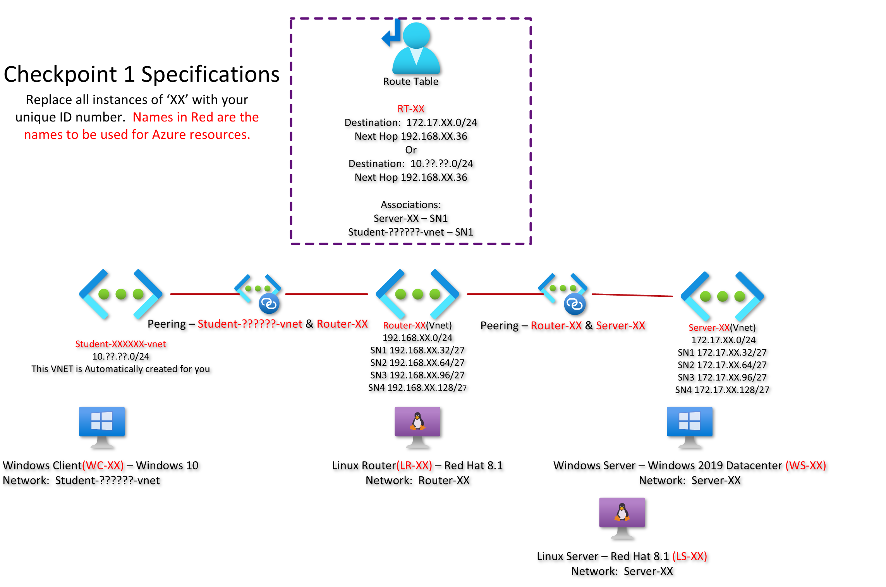

# Pre-Checkpoint1 Submission 

- **COURSE INFORMATION: CSN400 Computer Systems Project**
- **STUDENT’S NAME: Kiranpreet Kaur**
- **STUDENT'S NUMBER: 128814217**
- **GITHUB USER_ID: myseneca-128814217**
- **TEACHER’S NAME:Atoosa-Nasiri** 


## Table of Contents
- [NETWORK TOPOLOGY](#network-topology)
- [SINGLE LINE CODE SNIPPET](#single-line-code-snippet)
- [MULTI LINE CODE SNIPPET](#multi-line-code-snippet)
- [SAMPLE JASON OBJECT](#sample-jason-object)
- [SAMPLE TABLES](#sample-tables)
- [SAMPLE HYPERLINKS](#sample-hyperlinks)

### Network Topology



### Single Line Code Snippet
`echo "Hello World"`


### Bash Script
```bash
#!/bin/bash
for (( i=1; i<=6; i++ )); do
     echo "This is loop: $i"
done
```

### json object
```json
{
"company": "Nudestix"
"companycontacts" : {
  "phone": "647-231-8400",
  "email": "kkaur491@nudestix.com"
 },
 "employees" : [
 {
   "employee_id": 440,
   "name": "Jasjot",
   "contacts": [
       "manvir@nudestix.com" ,
       "jasman@nudestix.com"
       ]
     },
   {
   "employee_id": 350,
   "name":"Kiran",
   "contacts": null
   }
  ]
 }
 ```
  


### Sample Tables
**EmployeeID** | **Name** | **Gender** | **Salary**
--- | --- | --- | ---
101 | Suraj | Male | 10000
102 | Mani | Male | 20000
103 | Kiran | Female | 25000
104 | Mansi | Female | 26000


### Sample Hyperlinks
_to be completed_


